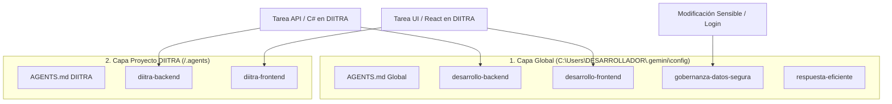

# Ecosistema de Skills y Reglas para Antigravity / Gemini

Este repositorio centraliza y organiza la configuración de **Skills** y **Reglas (AGENTS.md)** tanto globales como específicas de proyectos (como DIITRA) para el agente Antigravity.

---

## Estructura del Repositorio

```text
skills_jorge/
├── global/
│   ├── AGENTS.md                   # Reglas universales de comportamiento, ahorro de tokens y orquestación
│   └── skills/                     # Skills globales compartidas entre todos los proyectos
│       ├── desarrollo-backend/     # Estándares globales C#, ASP.NET Core, EF Core, SOLID
│       ├── desarrollo-frontend/    # Estándares globales React, TS, UI/UX premium, CSS
│       ├── gobernanza-datos-segura/# Seguridad en BD, credenciales y datos de prueba
│       ├── respuesta-eficiente/    # Restricción de búsquedas y respuestas rápidas
│       └── sysadmin/               # Administración de sistemas Linux/Windows (senior)
│
├── diitra/
│   └── .agents/                    # Configuración del workspace específico DIITRA
│       ├── AGENTS.md               # Stack tecnológico de DIITRA y matriz de combinación de skills
│       └── skills/
│           ├── diitra-backend/     # Extensión: convenciones inv_, sigafi (solo lectura), EF Core
│           └── diitra-frontend/    # Extensión: Yjs, CoWorkField, snake_case, Axios, umbral 700 lineas
│
└── README.md                       # Guía de despliegue y orquestación (este archivo)
```

---

## Diagrama de Orquestación y Cascada de Skills

Cuando trabajas en un proyecto (ej. DIITRA), las habilidades operan en **cascada jerárquica**:



---

## Guía de Despliegue Manual (Instrucciones de Instalación)

Sigue estos dos sencillos pasos para instalar y activar la configuración completa en tu entorno local:

### Paso 1: Instalar la Capa Global en el IDE

Copia el contenido de `global/` al directorio de configuración global de Gemini en tu usuario de Windows:

1. **Copiar `global/AGENTS.md`**:
   - **Origen:** `skills_jorge/global/AGENTS.md`
   - **Destino:** `C:\Users\DESARROLLADOR\.gemini\config\AGENTS.md`

2. **Copiar las Skills Globales**:
   - **Origen:** `skills_jorge/global/skills/*` (las 5 carpetas: `desarrollo-backend`, `desarrollo-frontend`, `gobernanza-datos-segura`, `respuesta-eficiente`, `sysadmin`)
   - **Destino:** `C:\Users\DESARROLLADOR\.gemini\config\skills\`

---

### Paso 2: Instalar la Capa de Proyecto en DIITRA

Copia la carpeta `.agents` de DIITRA a la raíz de tu proyecto local de DIITRA:

1. **Copiar `.agents`**:
   - **Origen:** `skills_jorge/diitra/.agents/`
   - **Destino:** `c:\Users\DESARROLLADOR\Desktop\Proyectos\diitra\.agents\`

---

## Verificación de Instalación

Una vez instalados los archivos en sus destinos:
- Al abrir cualquier proyecto, el agente respetará las directrices del `AGENTS.md` global y tendrá disponibles las 4 skills globales (`desarrollo-backend`, `desarrollo-frontend`, `gobernanza-datos-segura`, `respuesta-eficiente`).
- Al abrir el proyecto **DIITRA**, el agente detectará automáticamente `.agents/` y combinará las directrices de `diitra-frontend` y `diitra-backend` con las skills globales correspondientes.
