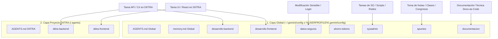

# Ecosistema de Skills y Reglas para Antigravity / Gemini

Este repositorio centraliza y organiza la configuración de **Skills** y **Reglas (AGENTS.md)** tanto globales como específicas de proyectos (como DIITRA) para el agente Antigravity.

---

## Estructura del Repositorio

```text
skills_jorge/
├── global/
│   ├── AGENTS.md                   # Reglas universales de comportamiento, ahorro de tokens y orquestación
│   ├── memory.md                   # Memoria global estable y persistente (perfil de Jorge y preferencias universales)
│   └── skills/                     # Skills globales compartidas entre todos los proyectos
│       ├── ahorro-tokens/          # Restricción de búsquedas y respuestas rápidas
│       ├── apuntes/                # Notas enriquecidas Markdown/Obsidian, clases, congresos y comandos rápidos
│       ├── datos-seguros/          # Seguridad en BD, credenciales y datos de prueba
│       ├── desarrollo-backend/     # Estándares universales (Clean Architecture, DDD, SOLID, APIs, cero parches)
│       ├── desarrollo-frontend/    # Estándares universales UI/UX (Multi-framework, Component-Driven, WCAG)
│       ├── documentacion/          # Documentación técnica modular Docs-as-Code (01-, 02-...), sin lenguaje marketero ni emojis
│       └── sysadmin/               # Administración de sistemas Linux/Windows y DevOps (senior)
│
├── ateneo/
│   └── .agents/                    # Simulador clínico médico (React 18 + Vite PWA, Material 3, GPC)
│       ├── AGENTS.md
│       ├── memory.md
│       └── skills/ateneo-design-system/
│
├── diitra/
│   └── .agents/                    # Ecosistema DIITRA (.NET 8, MySQL, Yjs CoWork, Geist)
│       ├── AGENTS.md
│       ├── memory.md
│       └── skills/ (backend-diitra, frontend-diitra, styles-diitra)
│
├── dosier/
│   └── .agents/                    # Sistema Curricular PEA (Clean Arch 4 capas, iText 9, Yjs SignalR)
│       ├── AGENTS.md
│       ├── memory.md
│       └── skills/ (backend-dosier, documentacion-dosier, frontend-dosier, styles-dosier)
│
├── erp_pymes/
│   └── .agents/                    # ERP Empresarial B2B (Estándar Holded / Xero / Linear)
│       ├── AGENTS.md
│       ├── memory.md
│       └── skills/estilos-erp-pymes/
│
├── jorge_doicela/
│   └── .agents/                    # Monorepo Personal pnpm (NestJS, Next.js, 1 GB RAM AWS Lightsail)
│       ├── AGENTS.md
│       ├── memory.md
│       └── skills/ (bible, landing, portfolio, software, infraestructura-global)
│
├── titan_titulacion/
│   └── .agents/                    # Sistema Titulación ISTPET (.NET 8/9 C#, Clean Architecture, MySQL)
│       ├── AGENTS.md
│       ├── memory.md
│       └── skills/ (titulacion-backend, titulacion-frontend, titulacion-ui-design)
│
└── README.md                       # Guía de despliegue y orquestación (este archivo)
```

---

## Diagrama de Orquestación y Cascada de Skills

Cuando trabajas en un proyecto (ej. DIITRA), las habilidades operan en **cascada jerárquica**:


```mermaid
flowchart TD
    subgraph global ["1. Capa Global (~/.gemini/config o %USERPROFILE%\.gemini\config)"]
        G_AGENTS["AGENTS.md Global"]
        G_MEM["memory.md Global"]
        G_BE["desarrollo-backend"]
        G_FE["desarrollo-frontend"]
        G_SEC["datos-seguros"]
        G_EFF["ahorro-tokens"]
        G_SYS["sysadmin"]
        G_NOTES["apuntes"]
        G_DOCS["documentacion"]
    end

    subgraph PROYECTO ["2. Capa Proyecto DIITRA (<proyecto>/.agents)"]
        P_AGENTS["AGENTS.md DIITRA"]
        P_BE["diitra-backend"]
        P_FE["diitra-frontend"]
    end

    TaskFrontend["Tarea UI / React en DIITRA"] --> G_FE
    TaskFrontend --> P_FE

    TaskBackend["Tarea API / C# en DIITRA"] --> G_BE
    TaskBackend --> P_BE

    TaskSecurity["Modificación Sensible / Login"] --> G_SEC
    TaskSysAdmin["Tareas de SO / Scripts / Redes"] --> G_SYS
    TaskNotes["Toma de Notas / Clases / Congresos"] --> G_NOTES
    TaskDocs["Documentación Técnica Docs-as-Code"] --> G_DOCS
```

---

## Guía de Despliegue Manual (Multiplataforma: IDE y CLI)

Sigue estos pasos para instalar y activar la configuración en cualquier dispositivo (Windows, Linux o macOS):

### Paso 1: Instalar la Capa Global

Copia el contenido de `global/` al directorio de configuración global de Gemini/Antigravity de tu usuario.

#### En Windows (PowerShell):
```powershell
# Crear directorios si no existen
New-Item -ItemType Directory -Force -Path "$HOME\.gemini\config\skills"

# Copiar reglas globales AGENTS.md y memoria global estable
Copy-Item -Path "global\AGENTS.md" -Destination "$HOME\.gemini\config\AGENTS.md" -Force
Copy-Item -Path "global\memory.md" -Destination "$HOME\.gemini\config\memory.md" -Force

# Copiar las 7 skills globales
Copy-Item -Path "global\skills\*" -Destination "$HOME\.gemini\config\skills\" -Recurse -Force
```

#### En Linux / macOS (Bash / Zsh):
```bash
# Crear directorios si no existen
mkdir -p ~/.gemini/config/skills

# Copiar reglas globales AGENTS.md y memoria global estable
cp global/AGENTS.md ~/.gemini/config/AGENTS.md
cp global/memory.md ~/.gemini/config/memory.md

# Copiar las 7 skills globales
cp -r global/skills/* ~/.gemini/config/skills/
```

---

### Paso 2: Instalar la Capa de Proyecto en cada Repositorio

Copia la carpeta `.agents` de cada proyecto a la raíz de su respectivo workspace local:

#### En Windows (PowerShell):
```powershell
# Ejemplo para desplegar en cada proyecto según corresponda:
Copy-Item -Path "ateneo\.agents"          -Destination "C:\Ruta\A\ateneo\.agents"          -Recurse -Force
Copy-Item -Path "diitra\.agents"          -Destination "C:\Ruta\A\diitra\.agents"          -Recurse -Force
Copy-Item -Path "dosier\.agents"          -Destination "C:\Ruta\A\dosier\.agents"          -Recurse -Force
Copy-Item -Path "erp_pymes\.agents"       -Destination "C:\Ruta\A\erp_pymes\.agents"       -Recurse -Force
Copy-Item -Path "jorge_doicela\.agents"   -Destination "C:\Ruta\A\jorge_doicela\.agents"   -Recurse -Force
Copy-Item -Path "titan_titulacion\.agents"-Destination "C:\Ruta\A\titan_titulacion\.agents"-Recurse -Force
```

#### En Linux / macOS (Bash):
```bash
cp -r ateneo/.agents           ~/proyectos/ateneo/.agents
cp -r diitra/.agents           ~/proyectos/diitra/.agents
cp -r dosier/.agents           ~/proyectos/dosier/.agents
cp -r erp_pymes/.agents        ~/proyectos/erp_pymes/.agents
cp -r jorge_doicela/.agents    ~/proyectos/jorge_doicela/.agents
cp -r titan_titulacion/.agents ~/proyectos/titan_titulacion/.agents
```

---

## Verificación de Instalación

Una vez instalados los archivos en sus destinos:
- **Tanto en el IDE como en el CLI:** Al abrir cualquier proyecto, el agente respetará las directrices de `AGENTS.md` global, su memoria persistente `memory.md` y tendrá disponibles las 7 skills globales (`ahorro-tokens`, `apuntes`, `datos-seguros`, `desarrollo-backend`, `desarrollo-frontend`, `documentacion`, `sysadmin`).
- **Al abrir cualquier proyecto con `.agents/`:** El agente detectará automáticamente su configuración local, cargará su `AGENTS.md` y su `memory.md` específico y combinará sus skills locales con los estándares globales correspondientes.
