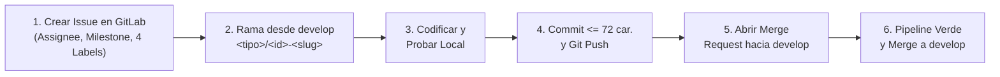

# Skill: GitFlow, GitLab CI/CD & Cheatsheet Institucional ISTPET

Esta skill contiene el 100% de las directrices operativas, reglas de linters, solución de errores y comandos rápidos de la guía institucional de GitFlow en ISTPET para backend y frontend.

---

## 1. El Ciclo de Desarrollo (Secuencia Obligatoria de 6 Pasos)

El pipeline automatizado bloquea subidas directas a `main` o con ramas/commits no estandarizados:



---

## 2. Paso a Paso Operativo Detallado

### Paso 1: Creación del Issue en GitLab
Nunca crear una rama ni codificar sin un Issue previo:
1. Ir a **Plan $\rightarrow$ Issues $\rightarrow$ New issue** en el repositorio (`departamento_medico_istpet` o `departamento_medico_istpet-front`).
2. **Título:** En infinitivo, claro y conciso (ej. `Integración de Autenticación SIGAFI y RBAC Médico` o `Implementación de Diseño Fluent 2 y Control de Sesión`).
3. **Descripción obligatoria:**
   ```markdown
   ### Qué se necesita
   Una o dos frases que expliquen qué falta, qué falla o qué se va a construir.

   ### Criterios de aceptación
   - [ ] Criterio 1 que debe cumplirse
   - [ ] Criterio 2 que debe cumplirse
   ```
4. **Atributos obligatorios en la barra lateral derecha:**
   * **Assignee:** Asignarse a sí mismo (`Assign to me` o `assign yourself`).
   * **Milestone:** Seleccionar el hito activo del proyecto (ej. `v1.0.0-nucleo-clinico-y-fichas-medicas` o `Arquitectura Base y Sistema de Diseño`).
   * **Labels (4 obligatorias):**
     1. Tipo (1 obligatorio): `type::feature` | `type::bug` | `type::chore` | `type::hotfix`
     2. Prioridad (1 obligatorio): `priority::p1-critical` | `priority::p2-high` | `priority::p3-medium`
     3. Estado de flujo inicial (2 obligatorios): `workflow::ready-to-dev` y `workflow::in-review` (o `workflow::in-progress`)
5. **Anotar el número de Issue** asignado (ej. `#18` o `#20`).

---

### Paso 2: Creación de la Rama Git (Patrón Estricto)
El linter `gitflow:rama` valida mediante regex el formato exacto:
$$\mathbf{<tipo>/<id-issue>-<slug>}$$

* `<tipo>`: `feature`, `bugfix`, `hotfix` o `chore` (debe coincidir con la etiqueta del issue).
* `<id-issue>`: Número del Issue sin el prefijo `#`.
* `<slug>`: Palabras en minúsculas separadas por guiones sin caracteres especiales ni tildes.

| Correcto | Incorrecto | Razón del Fallo |
| :--- | :--- | :--- |
| `feature/18-integracion-rbac-sigafi` | `feat/integracion-rbac` | Falta el número de issue |
| `chore/19-configuracion-local` | `19-configuracion` | Falta el prefijo de tipo (`chore/`) |
| `bugfix/22-corregir-color-boton` | `bugfix/22_corregir_color` | Usa guiones bajos en lugar de guiones normales |

```powershell
# REGLA OBLIGATORIA ISTPET: Las ramas de trabajo SIEMPRE nacen de develop, NUNCA de main.
git checkout develop
git pull origin develop

# Crear y moverse a la nueva rama
git checkout -b feature/18-integracion-rbac-sigafi
```

---

### Paso 3: Pruebas Locales Previas
Antes de realizar commits, verificar que no existan errores:
* **Backend (.NET 8):**
  ```powershell
  dotnet test --configuration Release
  ```
  *Verificar que indique: `Correctas! Con error: 0`.*
* **Frontend (Angular):**
  ```powershell
  npm test -- --watch=false
  npm run build
  ```
  *Verificar compilación con código de salida 0.*

---

### Paso 4: Commits Convencionales (Regla de Oro de los 72 Caracteres)
El job `gitflow:commits` rechaza el push si el asunto tiene menos de 10 o más de 72 caracteres:
* **Formato:**
  ```text
  tipo(alcance): asunto en presente y sin punto final (ENTRE 10 Y 72 CARACTERES)

  - Cuerpo explicativo punto 1
  - Cuerpo explicativo punto 2
  ```
* **Tipos permitidos:** `feat`, `fix`, `chore`, `docs`, `refactor`.
* **Ejemplo estructurado en PowerShell:**
  ```powershell
  git add .
  git commit -m "feat(ui): implementar diseno Fluent 2 institucional y RBAC" -m "- Diseno institucional basado en Microsoft Fluent 2 con paleta oficial ISTPET
- Soporte para modo claro y modo oscuro armonioso sin emojis
- Integracion de RbacServicio reactivo con Angular Signals"
  ```
  *(Contador de ejemplo: `feat(auth): integrar autenticacion SIGAFI y RBAC institucional` = 62 caracteres ✅).*

---

### Paso 5: Push al Remoto
```powershell
git push -u origin feature/18-integracion-rbac-sigafi
```
GitLab responderá en la terminal con la URL directa para abrir el Merge Request.

---

### Paso 6: Creación del Merge Request (MR) en GitLab
1. Ir al enlace o a **Merge requests $\rightarrow$ New merge request**.
2. **Source branch:** Tu rama $\rightarrow$ **Target branch:** **`develop`** (🚨 **PROHIBIDO APUNTAR A MAIN**: Solo `release/x.y` y `hotfix/*` van a `main`. Todo feature, chore o bugfix DEBE apuntar a `develop`).
3. **Title:** Asunto del commit (entre 10 y 72 caracteres).
4. **Description:** Obligatorio contener exactamente estas 5 secciones (validado por `gitflow:plantilla`):
   ```markdown
   ### Qué cambia
   Una o dos frases claras explicando qué funcionalidad nueva o corrección aporta este cambio.

   ### Issue
   Closes #18

   ### Cómo probar
   1. Paso uno para que el revisor levante o pruebe el cambio.
   2. Paso dos (ej. comando de test o URL que debe abrir).
   3. Resultado esperado visible.

   ### Notas para el revisor
   - Detalles arquitectónicos relevantes o decisiones tomadas.
   - Confirmación de que no se agregan dependencias innecesarias.

   ### Checklist
   - [x] La rama sigue la convención <tipo>/<id-issue>-slug
   - [x] Milestone asignado (el mismo del issue)
   - [x] Label type::* puesto
   - [x] Sin secretos, .env ni credenciales en el diff
   - [x] Pipeline verde
   - [x] Revisor asignado
   ```
   > **Importante:** En la sección `### Issue`, debe decir obligatoriamente `Closes #XX`. Sin esto, el validador `gitflow:issue` bloquea el MR.
5. **Configuración en la barra lateral del MR:**
   * **Assignee:** Asignarse a sí mismo (`Assign to me`).
   * **Reviewer:** Asignar a compañero o líder técnico.
   * **Milestone:** El mismo del Issue.
   * **Labels:** Asegurar la etiqueta `type::*` (ej. `type::feature`).

---

## 3. Matriz de Linters del Pipeline CI/CD

```
┌────────────────────────────────────────────────────────────────────────┐
│                        STAGE: validar (Git Flow)                       │
├─────────────────┬──────────────────────────────────────────────────────┤
│ gitflow:rama    │ Verifica formato <tipo>/<id>-slug                    │
│ gitflow:commits │ Valida que el asunto tenga entre 10 y 72 caracteres  │
│ gitflow:issue   │ Comprueba que exista "Closes #ID" y esté abierto     │
│ gitflow:metadatos│ Valida que el MR tenga Milestone y Label type::*    │
│ gitflow:plantilla│ Revisa que la descripción tenga las 5 secciones      │
│ gitflow:secretos│ Escaneo Gitleaks buscando contraseñas o tokens       │
└─────────────────┴──────────────────────────────────────────────────────┘
                                  │
                                  ▼
┌────────────────────────────────────────────────────────────────────────┐
│                        STAGE: test / build                             │
├─────────────────┬──────────────────────────────────────────────────────┤
│ test (Back/Front)│ Ejecuta "dotnet test" o "npm test"                   │
│ build           │ Compila los bundles de producción sin errores        │
└─────────────────┴──────────────────────────────────────────────────────┘
```

---

## 4. Solución de Errores Comunes en 1 Minuto

1. **Error: `ERROR (supera 72): Un asunto debe describir el cambio en entre 10 y 72 caracteres`**
   ```powershell
   git commit --amend -m "feat(ui): implementar diseno Fluent 2 y soporte RBAC" -m "- Detalle del cambio"
   git push --force-with-lease origin TU_RAMA
   ```
2. **Error: `gitflow:rama fallido` (nombre de rama incorrecto):**
   ```powershell
   # Renombrar rama localmente
   git branch -m tipo/NUMERO_ISSUE-nombre-correcto
   # Subir la nueva rama corregida
   git push -u origin tipo/NUMERO_ISSUE-nombre-correcto
   ```
3. **Error: `WARNING: fetching dl-cdn.alpinelinux.org: temporary error` en GitLab Runner:**
   * Causa: Microcorte de red/DNS en el runner al descargar paquetes en contenedor Docker.
   * Solución: En GitLab, entrar al Job fallido y hacer clic en **Retry** (flecha circular).
4. **Error: `gitflow:issue fallido`:**
   * Causa: Se escribió `Close #18`, `#18` o falta la sección `### Issue`.
   * Solución: Editar la descripción del MR y asegurar la sección exacta:
     ```markdown
     ### Issue
     Closes #18
     ```
5. **Error: `gitflow:metadatos fallido`:**
   * Solución: En la barra lateral derecha del MR, hacer clic en **Edit** en Milestone y Labels, y colocar el mismo Milestone y el label `type::*` que tiene el Issue.
6. **Error: `gitflow:secretos fallido` (Falso positivo de Gitleaks):**
   * Causa: Gitleaks confundió un nombre de clase, comentario o identificador público con un secreto (`generic-api-key`).
   * Solución: En `.gitleaks.toml`, agregar el commit y/o regex bajo `[allowlist]`:
     ```toml
     regexes = [ '''NombreFalsoPositivo''' ]
     commits = [ "sha-del-commit-reportado" ]
     ```
   * Commitear como `chore(ci): documentar falso positivo de gitleaks en <modulo>`.
7. **Error: Merge accidental a `main` en lugar de `develop`:**
   * Causa: Se dejó `main` como rama destino al crear el Merge Request en GitLab.
   * Solución:
     1. En GitLab, ir al commit o MR fusionado y hacer clic en **Revert**.
     2. Si el pipeline rechaza la rama `revert-*`, crear localmente una rama de tipo hotfix: `git checkout -b hotfix/<id>-revertir-merge origin/revert-<hash>` y pushearla.
     3. Abrir MR con rama fuente `hotfix/<id>-...` hacia `main` con label `type::hotfix` y fusionarla para restaurar `main`.
     4. Fusionar la rama de trabajo hacia `develop`.
     5. Eliminar la rama temporal residual que GitLab crea en el remoto: `git push origin --delete revert-<hash>` y limpiar localmente con `git fetch --prune origin`.

---

## 5. Parámetros de Conexión: Local vs. Kubernetes K3s

### En Desarrollo Local (`localhost`):
* **Backend:** Cadenas de conexión de prueba en laboratorio institucional:
  ```powershell
  $env:ConnectionStrings__DepartamentoMedico="Server=192.168.7.50;Port=3307;Database=departamento_medico;User=root;Password=rootpass57;"
  $env:ConnectionStrings__Sigafi="Server=192.168.7.50;Port=3307;Database=sigafi_es;User=root;Password=rootpass57;"
  dotnet run --project src/Istpet.DepartamentoMedico.WebApi --launch-profile http
  ```
* **Frontend:** Si `public/config.json` no está creado, la aplicación cuenta con fallback automático en `configuracion.ts` hacia `http://localhost:5000/api` y Microsoft Entra ID institucional.

### En Kubernetes K3s:
* **Frontend:** El clúster inyecta `config.json` mediante el ConfigMap `departamento-medico-front-config` en `/app/dist/sistema-medico-front/browser/config.json`.
* **Backend:** Inyección de cadenas desde Secrets (`secret-db-staging.yaml` / `secret-db-production.yaml`).

---

## 6. Cheatsheet Rápido de Comandos

```powershell
# ==========================================
# 1. EMPEZAR UNA TAREA (después de crear el Issue #XX)
# ==========================================
# OBLIGATORIO: siempre desde develop
git checkout develop
git pull origin develop
git checkout -b feature/XX-nombre-tarea

# ==========================================
# 2. PROBAR ANTES DE GUARDAR
# ==========================================
# En Backend:
dotnet test --configuration Release
# En Frontend:
npm test -- --watch=false

# ==========================================
# 3. GUARDAR Y SUBIR (Asunto entre 10 y 72 caracteres)
# ==========================================
git status
git add .
git commit -m "feat(modulo): descripcion corta del cambio" -m "- Detalle 1`n- Detalle 2"
git push -u origin feature/XX-nombre-tarea

# ==========================================
# 4. CORREGIR UN COMMIT SI EL PIPELINE RECHAZA EL TÍTULO
# ==========================================
git commit --amend -m "feat(modulo): nuevo titulo mas corto" -m "- Mismos detalles"
git push --force-with-lease origin feature/XX-nombre-tarea
```
